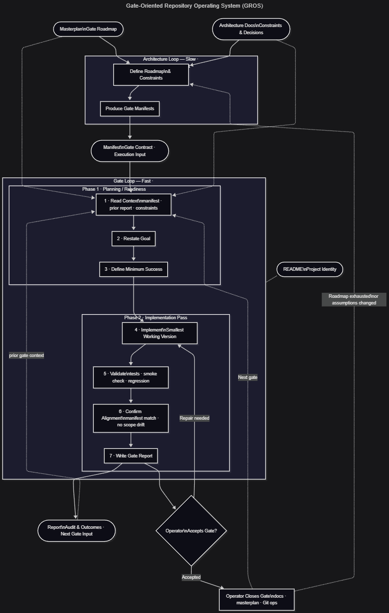
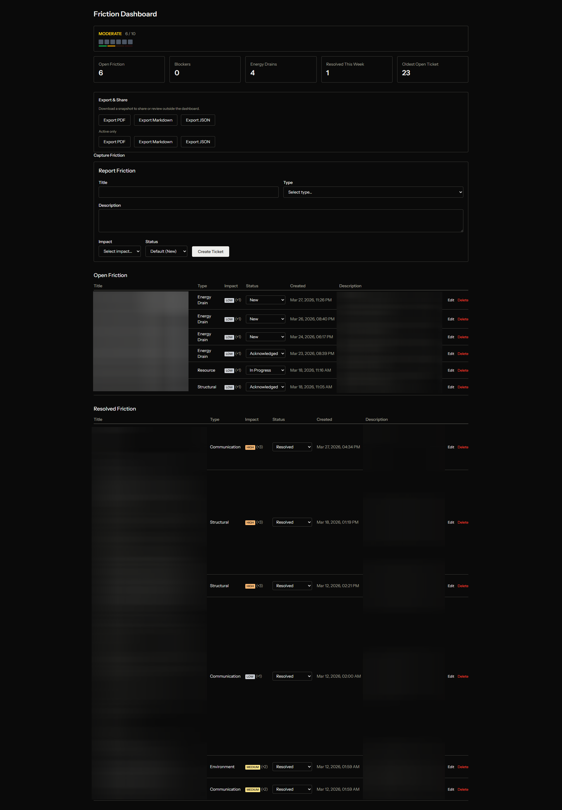

# Raccoon System Map

A surface-level map of systems I'm building or maintaining.
Shows direction, scope, and relationships — not internals.
This is a controlled visibility layer, not a portfolio.

---

## Infrastructure & Tooling

### Repo Operating Kit (GROS)

An operating model distilled from repeated development friction across real repositories.
Defines a two-loop structure: slow architecture planning, fast gated execution.
Applied across all projects below as the shared development discipline.



Stack: Markdown, Mermaid diagrams, Git discipline

### Repo Support Toolkit

A Python CLI that gives any Git repository a standard observability layer.

Turns repo-context prep for LLM use from a manual 5–10 minute workflow into a repeatable one-command step.

Packages repo state so an LLM can reason about a repository without direct repo access.
Extends the same model to multi-repo visibility via a single workspace scan.

Not a linter, CI layer, or auto-fixer — an observability/context bridge between local repos and LLM workflows.

`rst full` is the single operator entry surface that runs all core commands and writes a combined `report.txt`; `rst workspace scan` extends observability across every repo in the workspace; pack artifacts (`SESSION_MANIFEST`, `SNAPSHOT`, `HEALTH`) are the concrete handoff format between local state and LLM sessions.

```
rst snapshot       — capture repo state (human-readable, JSON, compact)
rst health         — evaluate repo health signals + LOC analysis
rst pack           — bundle context for AI-assisted collaboration
rst diff           — summarize recent changes
rst init           — initialize config for a target repo
rst doctor         — diagnose toolkit setup
rst workspace scan — scan all repos in workspace; write multi-repo snapshot
rst full           — composite operator entry; orchestrates core commands, writes report.txt
```

Stack: Python 3.10+, pytest · v0.10.0
Profiles: generic, Python, Laravel

---

## Applications

### Friction Dashboard

A personal dashboard for capturing and tracking workplace friction —
blockers, energy drains, unclear tasks, missing permissions.
Turns vague work problems into structured, trackable issues.

Two surfaces: a local operator workflow built on Laravel + MySQL + Docker, and a
public browser-local version that requires no account and holds no server-side
storage of friction data. JSON Save/Load is the portable data boundary; exported
friction data can be used as external reflection context, including with AI.

→ [friction-dashboard.pages.dev/build/resources/public](https://friction-dashboard.pages.dev/build/resources/public)



Stack: Laravel 12, MySQL, Docker · v0.10.0

### Signal Board

A fast RSS-based signal scanner.
Low-friction overview across regions — open, scan, close.

Stack: Laravel 12, PHP 8.5, MySQL, Docker · Gate 2 of 5 complete · 31 tests

---

## Game Systems

### Idle Lab

A tick-based idle game backend with offline progression.
Server-authoritative: all game math runs server-side.
The frontend is a projection layer — it displays signals from the backend, not its own logic.

Mechanics: producers, upgrades, extraction, hub progression, deterministic offline catch-up.

Stack: Laravel 12, MySQL, Docker · Gate B45 shipped · 37 test files

---

## Other

Additional systems exist (AI orchestration, automation pipelines, game/server tooling),
but are not surfaced here.

---

## Ideas

Thinking primitives have moved to a private archive.

---

## What this repo is not

This is not a portfolio, a code mirror, or a recruiting artifact.
Source code, internal architecture, protocols, and implementation details
live in private repositories.

What's here is the shape of the work, not its substance.

---

## Support (optional)

GitHub Sponsors is available for the work represented here.

No obligations, no deliverables, and no expectations on either side.

→ [github.com/sponsors/voidnull00](https://github.com/sponsors/voidnull00)
